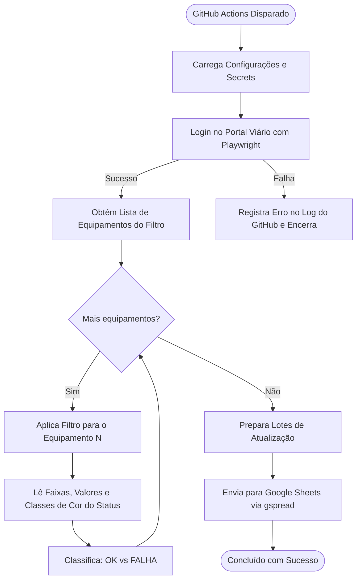

# Documento de Arquitetura e Design: Controle de Fluxo Viário

## 1. Resumo do Projeto (Understanding Summary)
* **Objetivo:** Automatizar a verificação periódica de integridade dos fluxos de tráfego em radares viários através de uma plataforma web com login.
* **Problema Resolvido:** Eliminar a conferência manual diária, identificando rapidamente faixas de equipamentos que apresentem ausência de geração de fluxo (status vazio ou em vermelho).
* **Público de Acesso:** Equipe técnica e operacional que consultará os dados diretamente pelo Google Sheets.
* **Destino dos Dados:** Planilha Google Sheets com duas abas estruturadas:
  1. `Historico_Geral`: Armazena todas as leituras cronológicas.
  2. `Pendencias_Tecnicas`: Filtra e isola exclusivamente equipamentos com falhas/anomalias.
* **Frequência:** Duas execuções diárias agendadas (07:50 e 13:30 - Horário de Brasília) via GitHub Actions (UTC 10:50 e 16:30), além de acionamento manual sob demanda (`workflow_dispatch`).

---

## 2. Premissas e Limitações (Assumptions)
* **Autenticação:** Login padrão por usuário/senha sem captcha impeditivo diário.
* **Filtros do Site:** A plataforma exibe 1 equipamento por vez após a aplicação de filtro/select. O robô iterará dinamicamente sobre a lista de equipamentos.
* **Infraestrutura:** Custo zero de servidores, operando 100% sobre GitHub Actions + Google Sheets API (Service Account).
* **Segurança:** Nenhuma credencial ou chave privada será versionada no Git. Todos os dados sensíveis residirão em GitHub Secrets e `.env` local.

---

## 3. Registro de Decisões (Decision Log)

| ID | Decisão | Alternativas Consideradas | Justificativa |
|---|---|---|---|
| **DEC-01** | Google Sheets como interface final para a equipe técnica. | Dashboard Web próprio, Banco SQL, Envio de arquivo Excel por e-mail. | Acesso em nuvem instantâneo, compartilhado e familiar sem exigir software extra ou treinamento. |
| **DEC-02** | GitHub Actions como orquestrador e agendador em nuvem. | VPS Linux (crontab), AWS Lambda, Execução manual local. | Gratuito, sem custos de manutenção de infraestrutura, com logs centralizados e execução sob demanda fácil. |
| **DEC-03** | Arquitetura modular Python com Playwright (`src/scraper.py`, `src/analyzer.py`, `src/sheets_service.py`). | Script monolítico único ou Scraper puramente HTTP (requests). | Playwright renderiza o DOM com precisão para capturar cores de status (vermelho) e interagir com filtros de seleção por equipamento com resiliência. |
| **DEC-04** | Iteração com timeout individual por equipamento. | Interrupção imediata em caso de erro. | Evita que uma falha transitória em um único radar comprometa a auditoria dos demais equipamentos. |
| **DEC-05** | Gestão de segredos via GitHub Secrets e `.env`. | Chaves em código ou arquivos soltos. | Garantia total de segurança e boas práticas de DevOps/SecOps. |
| **DEC-06** | Ajuste de fuso horário UTC $\leftrightarrow$ Brasília no Cron e Timestamps. | Confiar no horário padrão UTC do runner. | Evita inconsistências temporais nas decisões dos técnicos. |

---

## 4. Estrutura do Projeto

```text
controle-fluxo/
├── .github/
│   └── workflows/
│       └── daily_monitor.yml       # Orquestração GitHub Actions
├── src/
│   ├── __init__.py
│   ├── config.py                   # Configurações e variáveis de ambiente
│   ├── scraper.py                  # Autenticação e extração no site com Playwright
│   ├── analyzer.py                 # Análise de regras de falha (vazio/vermelho)
│   └── sheets_service.py           # Integração com Google Sheets (gspread)
├── main.py                         # Ponto de entrada do fluxo
├── requirements.txt                # Dependências Python
├── .env.example                    # Modelo de variáveis de ambiente
├── .gitignore                      # Proteção contra commit de credenciais (.env, *.json)
└── README.md                       # Documentação de uso e configuração de Secrets
```

---

## 5. Fluxo de Dados e Tratamento de Erros


