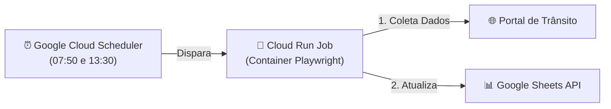

# ☁️ Guia de Configuração: Google Cloud Scheduler + Cloud Run Jobs

Este guia ensina como executar o **Controle de Fluxo Viário** de forma 100% serverless na nuvem do Google usando o **Google Cloud Scheduler** e o **Cloud Run Jobs** (custo zero dentro do limite gratuito do Google Cloud).

---

## 🏗️ Arquitetura no Google Cloud



---

## 🛠️ Passo a Passo de Implantação (Google Cloud CLI)

### 1. Pré-requisitos
* Ter uma conta no [Google Cloud Console](https://console.cloud.google.com/).
* Ter a ferramenta `gcloud` instalada (ou usar o **Cloud Shell** direto no navegador).

### 2. Ativar as APIs necessárias
```bash
gcloud services enable \
    run.googleapis.com \
    cloudscheduler.googleapis.com \
    cloudbuild.googleapis.com \
    artifactregistry.googleapis.com
```

### 3. Construir e Enviar a Imagem Docker (via Cloud Build)
Suba a imagem do robô para o Artifact Registry do Google Cloud:
```bash
gcloud builds submit --tag gcr.io/SEU_PROJECT_ID/controle-fluxo-viario .
```

### 4. Criar o Job no Cloud Run
```bash
gcloud run jobs create job-controle-fluxo \
    --image gcr.io/SEU_PROJECT_ID/controle-fluxo-viario \
    --region southamerica-east1 \
    --set-env-vars "SITE_BASE_URL=https://portal-monitoramento.exemplo.com.br,SITE_LOGIN_URL=https://portal-monitoramento.exemplo.com.br/login,SITE_USERNAME=seu_usuario,SITE_PASSWORD=sua_senha,GOOGLE_SHEET_ID=seu_sheet_id,HEADLESS=True,BROWSER_TIMEOUT_MS=45000" \
    --memory 2Gi \
    --cpu 1 \
    --max-retries 2
```

### 5. Configurar os Agendamentos no Google Cloud Scheduler

#### 🌅 Execução da Manhã (07:50 Horário de Brasília / 10:50 UTC):
```bash
gcloud scheduler jobs create http cron-fluxo-manha \
    --location southamerica-east1 \
    --schedule "50 10 * * *" \
    --uri "https://southamerica-east1-run.googleapis.com/apis/run.googleapis.com/v1/namespaces/SEU_PROJECT_ID/jobs/job-controle-fluxo:run" \
    --http-method POST \
    --oauth-service-account-email "seu-service-account@SEU_PROJECT_ID.iam.gserviceaccount.com"
```

#### ☀️ Execução da Tarde (13:30 Horário de Brasília / 16:30 UTC):
```bash
gcloud scheduler jobs create http cron-fluxo-tarde \
    --location southamerica-east1 \
    --schedule "30 16 * * *" \
    --uri "https://southamerica-east1-run.googleapis.com/apis/run.googleapis.com/v1/namespaces/SEU_PROJECT_ID/jobs/job-controle-fluxo:run" \
    --http-method POST \
    --oauth-service-account-email "seu-service-account@SEU_PROJECT_ID.iam.gserviceaccount.com"
```

---

## 🧪 Testar o Job Manualmente no Google Cloud
Para rodar um teste a qualquer momento no Google Cloud:
```bash
gcloud run jobs execute job-controle-fluxo --region southamerica-east1
```
Ou acesse o console web: **Cloud Run** $\rightarrow$ **Jobs** $\rightarrow$ **job-controle-fluxo** $\rightarrow$ **Executar**.
